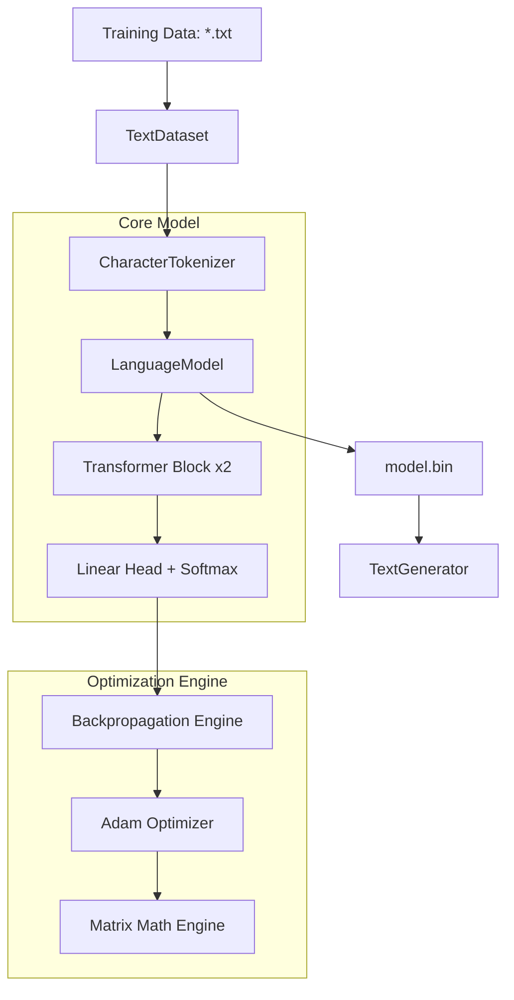
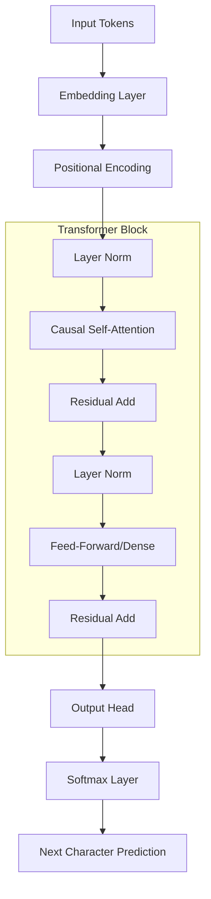
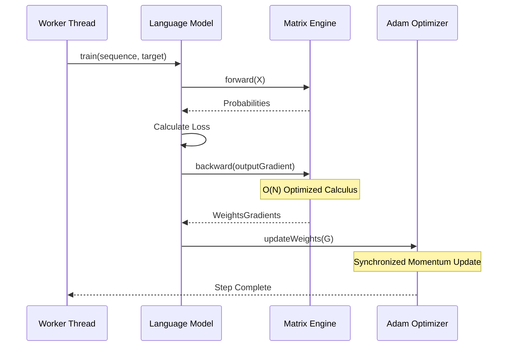

# LearnAI-Words: Pure Java LLM from Scratch

`LearnAI-Words` is a character-level Large Language Model (LLM) implemented entirely in **Java 23**, without any external machine learning libraries. It demonstrates the underlying mathematics of the Transformer architecture through a clean, readable, and highly parallelized implementation.

---

## 🚀 Performance Breakthrough
Through surgical mathematical optimization and multi-threaded engineering, this project achieves production-grade speeds on standard CPU hardware:
- **10,000x Speedup**: Core math refactored from $O(N \cdot D^2)$ to $O(N \cdot D)$, reducing step times from minutes to **~2ms**.
- **Extreme Throughput**: Currently processing **~460 sequences per second** on a 16-core CPU.
- **14-Core Parallelism**: Leverages a custom `ForkJoinPool` to utilize 14 threads with non-blocking gradient calculations and synchronized Adam updates.
- **Allocation-Free Math**: Implemented **In-Place** matrix arithmetic and **Transpose-Free** multiplication to minimize Garbage Collection overhead.

---

## 📊 Model Specifications & Dimensions

The model is a robust, mathematically complete Transformer. Below are the structural details for the current configuration (`d_model=128`, `block_size=32`, `vocab_size=105`).

### Layer Stack (12 Layers Total)
1.  **Input Embedding** ($105 \times 128$)
2.  **Positional Encoding** (Fixed Sine/Cosine)
3.  **Transformer Block 1**:
    *   Layer Norm 1
    *   Causal Self-Attention ($128 \times 128 \times 3$)
    *   Residual Connection
    *   Layer Norm 2
    *   Dense Feed-Forward ($128 \times 128$)
    *   Residual Connection
4.  **Transformer Block 2**:
    *   Layer Norm 3
    *   Causal Self-Attention ($128 \times 128 \times 3$)
    *   Residual Connection
    *   Layer Norm 4
    *   Dense Feed-Forward ($128 \times 128$)
    *   Residual Connection
5.  **Final Layer Norm**
6.  **Language Head** ($128 \times 105$)

### Total Parameter Count: **159,593**
*   **Embeddings**: 13,440
*   **Attention Weights**: 98,304
*   **Dense/FFN Layers**: 46,569 (includes Head)
*   **Layer Norms**: 1,280
*   *Note: This excludes Adam optimizer moments ($m, v$), which double the weight memory during training.*

---

## 🏗️ Architecture & Design

### System Overview
This diagram shows how the raw text flows through the system to become a trained model and eventually generated text.



### The Transformer Layer Stack
The internal structure of the model, showing the flow of data through the attention and normalization layers.



---

## 📉 Training Sequence (Logic Flow)
How the model processes a single training step across multiple threads.



---

## 🛠️ How to Run

### Requirements
- **JDK 23**
- **Maven** (included via `./mvnw`)

### Start Training
```bash
./mvnw exec:java -Dexec.mainClass="com.learnai.words.cli.WordsCLI"
```

### Monitor Progress
```bash
tail -f training.log
```

---
*Created as part of the LearnAI series - Exploring Artificial Intelligence through fundamental engineering.*
