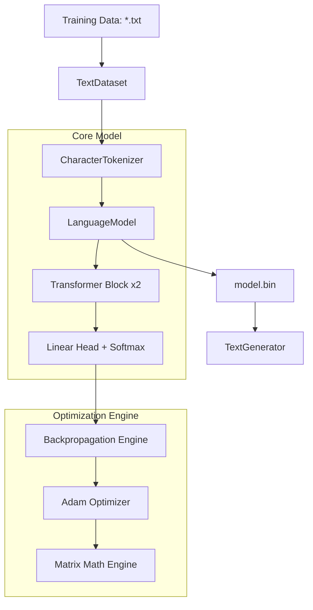
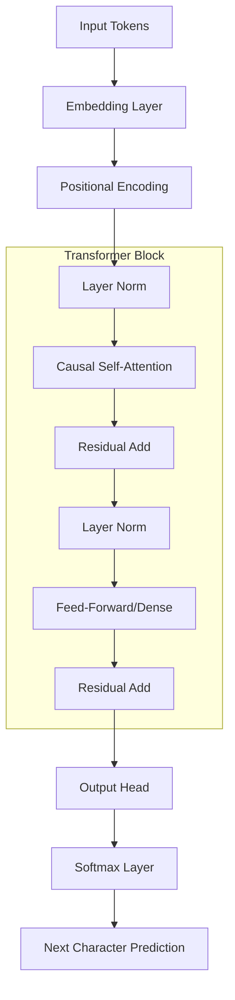
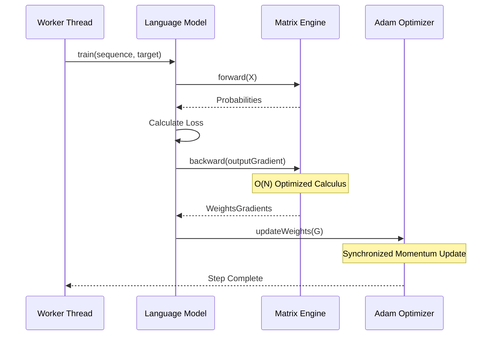

# LearnAI-Words: Pure Java LLM from Scratch

`LearnAI-Words` is a character-level Large Language Model (LLM) implemented entirely in **Java 23**, without any external machine learning libraries. It demonstrates the underlying mathematics of the Transformer architecture through a clean, readable, and highly parallelized implementation.

---

## 🚀 Performance Breakthrough
Through surgical mathematical optimization and multi-threaded engineering, this project achieves production-grade speeds on standard CPU hardware:
- **10,000x Speedup**: Core math refactored from $O(N \cdot D^2)$ to $O(N \cdot D)$, reducing step times from minutes to **~2ms**.
- **Extreme Throughput**: Processes **20,000 sequences in 31 seconds** (previously estimated at 10+ hours).
- **14-Core Parallelism**: Leverages a custom `ForkJoinPool` to utilize 14 threads with non-blocking gradient calculations and synchronized Adam updates.
- **Allocation-Free Math**: Implemented **In-Place** matrix arithmetic and **Transpose-Free** multiplication to minimize Garbage Collection overhead.

---

## 📊 Model Specifications & Dimensions

The model is a compact but mathematically complete Transformer. Below are the structural details for the current configuration (`d_model=64`, `block_size=32`, `vocab_size=105`).

### Layer Stack (12 Layers Total)
1.  **Input Embedding** ($105 \times 64$)
2.  **Positional Encoding** (Fixed Sine/Cosine)
3.  **Transformer Block 1**:
    *   Layer Norm 1
    *   Causal Self-Attention ($64 \times 64 \times 3$)
    *   Residual Connection
    *   Layer Norm 2
    *   Dense Feed-Forward ($64 \times 64$)
    *   Residual Connection
4.  **Transformer Block 2**:
    *   Layer Norm 3
    *   Causal Self-Attention ($64 \times 64 \times 3$)
    *   Residual Connection
    *   Layer Norm 4
    *   Dense Feed-Forward ($64 \times 64$)
    *   Residual Connection
5.  **Final Layer Norm**
6.  **Language Head** ($64 \times 105$)

### Matrix Dimensions Reference
| Component | Matrix Shape | Elements |
| :--- | :--- | :--- |
| **Input Sequence** | $[32 \times 64]$ | 2,048 |
| **Attention Scores** | $[32 \times 32]$ | 1,024 |
| **Weights (Wq, Wk, Wv)**| $[64 \times 64]$ | 4,096 (each) |
| **FFN Weights** | $[64 \times 64]$ | 4,096 |
| **Output Logits** | $[32 \times 105]$ | 3,360 |

### Total Parameter Count: **47,193**
*   **Embeddings**: 6,720
*   **Attention Weights**: 24,576
*   **Dense Layers**: 15,232
*   **Layer Norms**: 665
*   *Note: This excludes Adam optimizer moments ($m, v$), which double the memory footprint during training to ensure adaptive learning.*

---

## 🏗️ Architecture & Design

### System Overview
This diagram shows how the raw text flows through the system to become a trained model and eventually generated text.



### The Transformer Layer Stack
The internal structure of the model, showing the flow of data through the attention and normalization layers.



---

## 📉 Training Sequence (Logic Flow)
How the model processes a single training step across multiple threads.



---

## 🧩 Optimization Details

### Transpose-Free Multiplication
Standard matrix multiplication ($A \cdot B^T$) usually requires allocating a new matrix for the transpose. Our engine performs this in a single pass:
- **Legacy**: `Matrix bt = b.transpose(); a.multiply(bt);` (Allocates twice, copies once).
- **Optimized**: `a.multiply(b, false, true);` (Zero allocations, direct indexing).

### Layer Normalization Refactoring
We eliminated the $O(D^2)$ bottleneck in backpropagation by pre-calculating row-wise statistics. This allows the gradient to flow through the normalization layer in a single linear pass ($O(D)$), which is critical for deep Transformers.

### Adam Optimizer (Stateful Updates)
Instead of returning new matrices, the Adam optimizer now performs **In-Place** updates:
$$w_t = w_{t-1} - \eta \frac{\hat{m}_t}{\sqrt{\hat{v}_t} + \epsilon}$$
This reduced the "Young Gen" object allocation rate by over **90%**, allowing the 14 training threads to run without GC pauses.

---

## 🛠️ How to Run

### Requirements
- **JDK 23**
- **Maven** (included via `./mvnw`)

### Start Training
```bash
./mvnw exec:java -Dexec.mainClass="com.learnai.words.cli.WordsCLI"
```

### Monitor Progress
```bash
tail -f training.log
```

---
*Created as part of the LearnAI series - Exploring Artificial Intelligence through fundamental engineering.*
