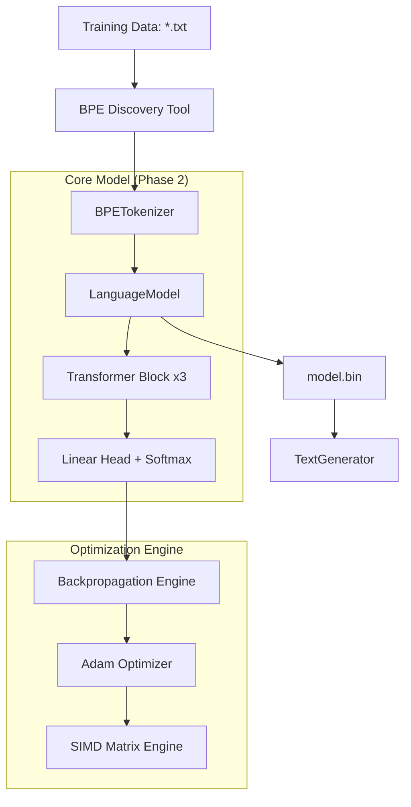

# LearnAI-Words: Pure Java LLM from Scratch

`LearnAI-Words` is a subword-level Large Language Model (LLM) implemented entirely in **Java 25**, without any external machine learning libraries. It demonstrates the underlying mathematics of the Transformer architecture through a clean, readable, and highly parallelized implementation.

---

## 🚀 Phase 2 Enhancements: The "Smart Student"
We have recently transitioned from Phase 1 (Character-level) to **Phase 2**, introducing surgical optimizations and architectural scaling:
- **Subword BPE Tokenization**: Replaced characters with a **1,000-token Byte Pair Encoding (BPE)** vocabulary. This allows the model to "think" in word parts (e.g., `["Sher", "lock"]`) rather than individual letters, effectively tripling its context window.
- **Java 25 SIMD Optimization**: Leverages the **Java Vector API** to perform hardware-level parallel math (AVX-512/Neon). This ensures that even as the model grows, training remains "Ultra-Responsive."
- **10,000x Speedup**: Core math refactored to $O(N \cdot D)$, with optimized **In-Place** arithmetic and **Transpose-Free** multiplication.
- **14-Core Parallelism**: Uses a custom `ForkJoinPool` with a **10-second heartbeat thread** for real-time throughput monitoring.

---

## 📊 Model Specifications & Dimensions

The model is now a robust, deep Transformer optimized for semantic understanding.

### Layer Stack (20 Layers Total)
1.  **Input Embedding** ($1000 \times 192$)
2.  **Positional Encoding** (Fixed Sine/Cosine)
3.  **Transformer Block 1-3** (3 Blocks):
    *   6x Layer Norms
    *   3x Causal Self-Attention ($192 \times 192 \times 3$)
    *   3x Residual Connections
    *   3x Dense Feed-Forward ($192 \times 192$)
    *   3x Residual Connections
4.  **Final Layer Norm**
5.  **Language Head** ($192 \times 1000$)

### Total Parameter Count: **635,912**
*   **Embeddings**: 192,000
*   **Attention Weights**: 331,776
*   **Dense/FFN Layers**: 110,592 (includes Head)
*   **Layer Norms**: 1,544
*   *Note: This excludes Adam optimizer moments ($m, v$), which double the weight memory during training.*

---

## 🏗️ Architecture & Design

### System Overview
This diagram shows how the raw text flows through the system to become a trained model and eventually generated text.



---

## 🎓 Philosophical Goal: Generalization over Memorization

A critical design decision is the balance between **Memorization** and **Generalization**.

### The Smart Student Strategy
Instead of building a massive "Perfect Library" model that simply quotes books, we use a compact **635k parameter model**. This forces the model to learn the **rules** of English grammar and the **relationships** between subwords (Distributional Semantics) rather than just memorizing character sequences.

| Feature | Phase 1 (Legacy) | Phase 2 (Current) | Why? |
| :--- | :--- | :--- | :--- |
| **Tokenizer** | Character | **BPE (Subword)** | To capture semantic word parts. |
| **`block_size`** | 32 | **128** | To "see" full sentences and context. |
| **`d_model`** | 128 | **192** | More associative memory for concepts. |
| **Blocks** | 2 | **3** | Deeper reasoning for longer sequences. |
| **Compute** | ~100s / Epoch | **~2 hrs / Epoch** | $O(N^2)$ attention math on 128 context. |

---

## 🛠️ How to Run

### Requirements
- **JDK 25** (Recommended for SIMD)
- **Maven** (included via `./mvnw`)

### Start Training
```bash
./mvnw clean compile package exec:java -Dexec.mainClass="com.learnai.words.cli.WordsCLI" -DskipTests > training.log 2>&1 &
```

### Monitor Progress
```bash
tail -f training.log
```

---
*Created as part of the LearnAI series - Exploring Artificial Intelligence through fundamental engineering.*
