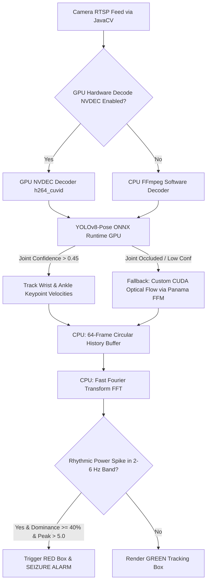

# TapoViewerMonitorV2: eGPU-Accelerated Epileptic Seizure Detection

A Java Swing application designed to monitor Tapo cameras via RTSP, control PTZ parameters via ONVIF, and perform real-time, GPU-accelerated person tracking and clonic seizure detection. 

The application is built for **Java 26** and utilizes an external NVIDIA GPU (RTX 5060 Ti) using a **hybrid CPU/GPU pipeline** powered by Microsoft ONNX Runtime GPU (CUDA/cuDNN) and custom CUDA kernels bound via Java's native **Foreign Function & Memory (FFM) Panama API**.

---

## 🚀 Key GPU & AI Features

*   **GPU Pose Estimation (YOLOv8-Pose):** Tracks 17 human skeletal joint coordinates in real-time. Driven by an ONNX Opset 19 model loaded into **ONNX Runtime GPU** using the native `CUDAExecutionProvider`.
*   **Panama FFM CUDA Fallback (Occlusion Handling):** When a patient is under bedding (causing joint tracking confidence to drop), the pipeline falls back to pixel-level motion differences. Calculations are offloaded to a custom GPU kernel (`libseizure_cuda.so`) written in CUDA C++ and called via Java's modern FFM API (`java.lang.foreign`), achieving near-zero overhead.
*   **Fast Fourier Transform (FFT) Frequency Analysis:** CPU-bound temporal signal processing converts rolling motion histories (64 frames, ~3.2 seconds) into the frequency domain using `Apache Commons Math`. Alerts are triggered strictly when rhythmic clonic oscillations dominate the **2 Hz to 6 Hz** band.
*   **Hardware Video Decoding (NVDEC):** A GUI toggle allows offloading H.264 RTSP stream decoding from the CPU to the NVIDIA eGPU using the native `h264_cuvid` FFmpeg codec.
*   **Modern Java Integration:** Uses JDK 26, vector operations (`jdk.incubator.vector`), and off-heap memory management.

---

## 🏗️ Hybrid Pipeline Architecture



### Phase 1: Spatial & Joint Extraction (eGPU-Bound)
The incoming video frames are processed on the NVIDIA GPU to distill millions of raw pixels down to key movement coordinates:
1.  **YOLOv8-Pose:** Frame inputs are normalized and resized to $640 \times 640$ on the CPU and copied to the GPU. The ONNX Runtime session runs inference via CUDA, returning bounding boxes and 17 coordinates.
2.  **Custom CUDA Optical Flow:** If the person is under blankets and joints cannot be resolved, we calculate pixel-wise intensity differences between successive frames. Grayscale byte buffers are passed to the GPU, processed in a block-reduction difference kernel (`motion_magnitude_kernel`), and the average motion magnitude is returned to Java.

### Phase 2: Frequency & Temporal Analysis (CPU-Bound)
Once a 64-frame history is established:
1.  **Velocity Vector Analysis:** Calculates the frame-to-frame Euclidean coordinate displacements for wrists and ankles.
2.  **FFT Conversion:** Transforms the velocity signals from the time domain into the frequency domain. 
3.  **Clonic Band Filtering:** Checks the power spectrum. If the power in the **2–6 Hz** frequency band accounts for $\ge 40\%$ of the total AC power and the peak amplitude exceeds $5.0$, a seizure is flagged. This filters out slow body rolls ($< 1\text{ Hz}$) and camera noise/vibrations ($> 6\text{ Hz}$).

---

## 📦 System Dependencies & Requirements

Since this program runs on a **System76 machine** (Pop!_OS / Ubuntu 22.04 LTS), it utilizes the native System76 CUDA compiler packages:

### 1. Host Packages
Install the required CUDA and cuDNN libraries from the System76 repositories:
```bash
# Install System76 CUDA 11.2 compiler and libraries
sudo apt install system76-cuda-11.2 system76-cuda-latest

# Install System76 cuDNN 8.x library (Required for ONNX GPU inference)
sudo apt install system76-cudnn-11.2
```

### 2. Environment Variables
To allow the Java Virtual Machine (JVM) to link successfully to the System76 CUDA libraries, `LD_LIBRARY_PATH` must be exported before launching:
```bash
export LD_LIBRARY_PATH=/usr/lib/cuda-11.2/targets/x86_64-linux/lib:$LD_LIBRARY_PATH
```

---

## ⚡ eGPU & CUDA Startup Optimization

On Linux eGPU setups, the NVIDIA driver will dynamically unload the GPU kernel modules when the card is idle, turning off the PCIe link. When a CUDA application starts, it will hang for **30 to 45 seconds** while the link powers up.

To prevent this delay and enable **instant start times**, turn on the NVIDIA driver **Persistence Mode**:
```bash
sudo nvidia-smi -pm 1
```

---

## 🛠️ Compilation & Execution

### 1. Compile the Custom CUDA Shared Library
Compile the native optical flow kernel into `libseizure_cuda.so` using `nvcc` and `g++-9`:
```bash
make -C src/main/native
```

### 2. Run the Main Application
Run the Maven wrapper with JDK 26 and native access flags:
```bash
export JAVA_HOME=/home/markvasey/.sdkman/candidates/java/26.0.1-tem
export PATH=$JAVA_HOME/bin:$PATH
export LD_LIBRARY_PATH=/usr/lib/cuda-11.2/targets/x86_64-linux/lib:$LD_LIBRARY_PATH

./mvnw clean compile exec:java -Dexec.mainClass="com.tapoviewer.TapoViewerMonitorApp"
```

---

## 🧪 Testing & Validation Utilities

We have created specialized test suites and validation runners to test GPU and detection capabilities:

### 1. Unit Tests
The project contains 8 offline JUnit 5 tests. It covers:
*   `testNormalMovementNoSeizure`: Random white noise input (must be rejected).
*   `testSeizureRhythmicMovementDetected`: Rhythmic 4 Hz movement (must detect peak at ~4.0 Hz).
*   `testSlowRhythmicMovementRejected`: 0.5 Hz rhythmic body shift (must be rejected).
*   `testFastRhythmicMovementRejected`: 9 Hz camera hum/vibration (must be rejected).
*   `testStaticObjectFiltering`: Low lifetime motion tracking (must hide as furniture).
*   `testCudaLibraryBinding`: Validates FFM native bridge bindings to `libseizure_cuda.so`.

Run the unit tests:
```bash
./mvnw clean test
```

### 2. Local Video Validation Runner (`VideoTester`)
Runs the complete GPU pipeline frame-by-frame on a local MP4 file to print detection logs and frequency tracking metrics:
```bash
java --add-modules jdk.incubator.vector --enable-native-access=ALL-UNNAMED \
  -cp target/classes:target/test-classes:$(cat classpath.txt) \
  com.tapoviewer.cli.VideoTester TestVideos/2026-06-11.cb6c8d4009c24e99a43072ea854c2c91.MP4
```

### 3. GPU Load Benchmark (`CudaLoadTester`)
Performs 8,000 FFM CUDA computations on 1080p frames in a tight loop to verify raw GPU memory and processor utilization in `nvtop`:
```bash
java --add-modules jdk.incubator.vector --enable-native-access=ALL-UNNAMED \
  -cp target/classes:target/test-classes:$(cat classpath.txt) \
  com.tapoviewer.cli.CudaLoadTester
```

---

## 🏗️ Class Reference Guide

*   **`com.tapoviewer.math.CudaBridge`:** Links Java `MethodHandle` calls to native symbols inside `libseizure_cuda.so` using the Panama FFM API. Handles off-heap memory segment passing.
*   **`com.tapoviewer.math.YoloPoseDetector`:** Preprocesses frame matrices to $640 \times 640$, creates float tensors, runs CUDA ONNX inference, and applies Non-Maximum Suppression (NMS) to isolate 17 joint keypoints.
*   **`com.tapoviewer.model.TrackedPerson`:** Tracks individual histories, calculates joint displacements, executes the FFT frequency transformations, and applies power threshold parameters.
*   **`com.tapoviewer.ui.VideoPanel`:** Grabs RTSP streams via JavaCV, invokes the GPU detectors, overlays the skeletal wireframes, and renders detected frequencies.
*   **`com.tapoviewer.ui.ControlPanel`:** UI configurations, credentials loading, PTZ ONVIF movements, and the **GPU Decode (NVDEC)** checkbox toggle.
