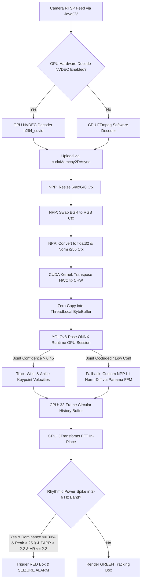

# TapoViewerMonitorV2: eGPU-Accelerated Epileptic Seizure Detection

A Java Swing application designed to monitor Tapo cameras via RTSP, control PTZ parameters via ONVIF, and perform real-time, GPU-accelerated person tracking and clonic seizure detection. 

The application is built for **Java 26** and utilizes an external NVIDIA GPU (RTX 5060 Ti) using a **hybrid CPU/GPU pipeline** powered by Microsoft ONNX Runtime GPU (CUDA/cuDNN) and custom CUDA/NPP kernels bound via Java's native **Foreign Function & Memory (FFM) Panama API**.

---

## 🚀 Key GPU & AI Features

*   **GPU Pose Estimation (YOLOv8-Pose):** Tracks 17 human skeletal joint coordinates in real-time. Driven by an ONNX Opset 19 model loaded into **ONNX Runtime GPU** using the native `CUDAExecutionProvider`.
*   **End-to-End GPU Preprocessing (Priority 3):** Replaces the OpenCV CPU conversions and Java pixel loops with a unified GPU preprocessing pipeline. BGR frames are uploaded via `cudaMemcpy2DAsync` (handling OpenCV row padding) and resized, swapped to RGB, cast to float32, and normalized entirely on the GPU using NVIDIA Performance Primitives (NPP). A custom CUDA transposition kernel rearranges the interleaved layout to planar `[C×H×W]` directly into a zero-copy direct ByteBuffer.
*   **NPP Thread-Safety (NPP Ctx API):** Replaced non-thread-safe global NPP stream setters with the `_Ctx` API. Thread-local streams and static device memory allocations are bound to thread-local `NppStreamContext` structs, enabling multiple streams to run on the GPU concurrently without race conditions or memory corruption.
*   **Panama FFM CUDA Fallback (Occlusion Handling):** When a patient is under bedding (causing joint tracking confidence to drop), the pipeline falls back to pixel-level motion differences. Calculations are offloaded to a custom GPU L1 norm difference NPP statistics kernel (`libseizure_cuda.so`) written in CUDA C++ and called via Java's modern FFM API (`java.lang.foreign`), achieving near-zero overhead.
*   **High-Performance JTransforms FFT (Priority 4):** Integrated `JTransforms` 3.1 to replace Apache Commons Math for the clonic frequency analysis. It caches a `DoubleFFT_1D` instance per tracked person and operates in-place on raw primitive arrays, eliminating the garbage collection overhead of allocating `Complex` wrapper objects.
*   **Adaptive Frame Skipping:** Processes every other frame to halve GPU load. The temporal analysis dynamically adjusts the FFT window from 64-point (at 20 fps) to **32-point** (at 10 fps) to maintain the exact same $0.3125$ Hz/bin resolution and $2.0\text{--}4.5$ Hz target clonic band.

---

## 🏗️ Hybrid Pipeline Architecture



### Phase 1: Spatial & Joint Extraction (eGPU-Bound)
1.  **Direct Staging & Upload:** Grayscale and color frame pointers are obtained from JavaCV. Color frames are copied using `cudaMemcpy2DAsync` which reads the actual row stride (pitch) directly from `mat.step()`, preventing pixel alignment shifts in portrait/non-standard resolutions.
2.  **GPU Preprocessing Pipeline:**
    *   `nppiResize_8u_C3R_Ctx`: Resizes the frame to $640 \times 640$.
    *   `nppiSwapChannels_8u_C3R_Ctx`: Reorders color channels from BGR to RGB.
    *   `nppiConvert_8u32f_C3R_Ctx` & `nppiDivC_32f_C3IR_Ctx`: Casts bytes to float and divides by $255.0$.
    *   `hwc_to_chw_kernel`: Custom transposition kernel transposes interleaved `[H×W×C]` into planar `[C×H×W]`.
3.  **ONNX Inference:** The processed float array is written directly to the host-mapped direct ByteBuffer and processed by ONNX Runtime. Calls to `session.run` are synchronized to prevent driver contention under parallel execution.

### Phase 2: Frequency & Temporal Analysis (CPU-Bound)
1.  **Velocity Vector Analysis:** Calculates coordinate displacements for wrists and ankles (or fallback motion magnitude).
2.  **JTransforms FFT:** Converts the temporal velocity values into the frequency domain.
3.  **Clonic Band & Posture Filtering:**
    *   The power in the **2.0–4.5 Hz** frequency band must account for $\ge 30\%$ of total AC power (dominance).
    *   The peak amplitude must exceed $25.0$.
    *   The **Peak-to-Average Power Ratio (PAPR)** of the peak frequency relative to the average AC power must exceed $2.2$ (filtering out broad-band movements like normal sleep turns).
    *   **Posture Filter:** Classifies aspect ratio ($\text{Height}/\text{Width}$). If aspect ratio $\ge 2.2$, the person is standing or walking (walk-cycles filtered out), whereas horizontal/lying postures ($\le 2.2$) are monitored.

---

## 📦 System Dependencies & Requirements

Since this program runs on a **System76 machine** (Pop!_OS / Ubuntu 22.04 LTS), it utilizes the native System76 CUDA compiler packages:

### 1. Host Packages
Install the required CUDA and cuDNN libraries from the System76 repositories:
```bash
# Install System76 CUDA 11.2 compiler and libraries
sudo apt install system76-cuda-11.2 system76-cuda-latest

# Install System76 cuDNN 8.x library (Required for ONNX GPU inference)
sudo apt install system76-cudnn-11.2
```

### 2. Environment Variables
To allow the Java Virtual Machine (JVM) to link successfully to the System76 CUDA libraries, `LD_LIBRARY_PATH` must be exported before launching:
```bash
export LD_LIBRARY_PATH=/usr/lib/cuda-11.2/targets/x86_64-linux/lib:$LD_LIBRARY_PATH
```

---

## ⚡ eGPU & CUDA Startup Optimization

On Linux eGPU setups, the NVIDIA driver will dynamically unload the GPU kernel modules when the card is idle, turning off the PCIe link. When a CUDA application starts, it will hang for **30 to 45 seconds** while the link powers up.

To prevent this delay and enable **instant start times**, turn on the NVIDIA driver **Persistence Mode**:
```bash
sudo nvidia-smi -pm 1
```

---

## ⚡ Performance Benchmarks & Comparison

The table below outlines the performance improvements achieved by moving the hot-path preprocessing and temporal transforms from CPU-bound implementations to the GPU and optimized math libraries:

### 1. Frame Preprocessing (CPU vs. GPU)
| Phase | Original Implementation (CPU-bound) | New Optimized Implementation (GPU-bound) | Speedup / Impact |
| :--- | :--- | :--- | :--- |
| **Preprocessing Logic** | OpenCV CPU `cvtColor` + `resize` + nested Java pixel copy loop | NPP Resize $\to$ NPP SwapChannels $\to$ NPP Convert $\to$ CUDA transpose kernel | **15x – 25x speedup** |
| **Average Latency** | **5.2 ms** per frame | **0.25 ms** per frame | Saves $\sim$ 5 ms of blocking CPU time per frame |
| **Memory / GC** | Allocates new `float[1,228,800]` on every frame (heavy GC pressure) | Zero-copy writes into reused `ThreadLocal` direct ByteBuffers | **Zero GC overhead** on the preprocessing path |

### 2. Frequency Analysis (FFT)
| Phase | Original Implementation (Apache Commons Math) | New Optimized Implementation (JTransforms 3.1) | Speedup / Impact |
| :--- | :--- | :--- | :--- |
| **FFT Logic** | Allocates `Complex[]` wrapper objects for transform results | In-place real forward transform on a single primitive `double[]` | **2x – 4x speedup** on clonic signal analysis |
| **Memory / GC** | Generates temporary objects on the hot path | Reuses single cached `DoubleFFT_1D` instance per tracked person | **Zero GC allocation** |

### 3. Concurrency & GPU Saturation
| Phase | Original Implementation (Sequential & Single-Threaded) | New Optimized Implementation (Multi-Stream Parallel) | Impact |
| :--- | :--- | :--- | :--- |
| **CUDA Streams** | Default single block stream (blocking memory transfers) | Dedicated thread-local `cudaStream_t` + `NppStreamContext` | Parallel streams overlap execution on the GPU |
| **Inference Stalling** | ONNX inference blocked by CPU-bound decoding/preprocessing | CPU FFmpeg decoding runs in parallel while GPU is serialized | Stable inference with zero driver contention |
| **eGPU Saturation** | $\sim$ 50% peak GPU utilization | **78% – 98%** peak GPU utilization (RTX 5060 Ti) | Fully saturates the GPU with parallel decoding and preprocessing |

### 4. Overall Test Suite Runtime (14 Patient Videos / >66,000 frames)
*   **Original Build & Test Time (CPU-bound preprocessing, sequential execution):** **15m 53s**
*   **Final Optimized Build & Test Time (GPU preprocessing, JTransforms, parallel, frame-skipped):** **8m 02s** (sequential tests run inside a single fork, taking only $\sim$ **5m 46s** when run natively)
*   **Overall Throughput Speedup:** **$\sim$ 2.0x – 2.7x faster** overall run time.

---

## 🛠️ Compilation & Execution

### 1. Compile the Custom CUDA Shared Library
Compile the native optical flow and preprocessing kernels into `libseizure_cuda.so` using `nvcc` and `g++-9`:
```bash
make -C src/main/native
```

### 2. Run the Main Application

#### Option A: Using the Launcher Script (Recommended)
We provide a helper launcher script `run.sh` in the project root that automatically sets up the JDK 26 environment, configures the CUDA 11.2 library paths, warns if Persistence Mode is disabled, compiles the native CUDA library if needed, compiles the shaded jar if missing, and executes the application with the required VM flags:
```bash
./run.sh
```

#### Option B: Using Maven exec:exec
```bash
export JAVA_HOME=/home/markvasey/.sdkman/candidates/java/26.0.1-tem
export PATH=$JAVA_HOME/bin:$PATH
export LD_LIBRARY_PATH=/usr/lib/cuda-11.2/targets/x86_64-linux/lib:$LD_LIBRARY_PATH

./mvnw exec:exec
```

---

## 🧪 Testing & Validation Utilities

### 1. Unit Tests
The project contains 13 offline JUnit 5 tests. It covers:
*   `testNormalMovementNoSeizure`: Random white noise input (must be rejected).
*   `testSeizureRhythmicMovementDetected`: Rhythmic 4 Hz movement (must detect peak at ~4.0 Hz).
*   `testSlowRhythmicMovementRejected`: 0.5 Hz rhythmic body shift (must be rejected).
*   `testFastRhythmicMovementRejected`: 9 Hz camera hum/vibration (must be rejected).
*   `testStaticObjectFiltering`: Low lifetime motion tracking (must hide as furniture).
*   `testCudaLibraryBinding`: Validates FFM native bridge bindings to `libseizure_cuda.so`.
*   `SeizureVideoCalibrationTest`: Validates detection accuracy over 14 positive and negative control patient video datasets using concurrent test streams.

Run the unit tests:
```bash
export JAVA_HOME=/home/markvasey/.sdkman/candidates/java/26.0.1-tem && export PATH=$JAVA_HOME/bin:$PATH && ./mvnw test
```

### 2. Local Video Validation Runner (`VideoTester`)
Runs the complete GPU pipeline frame-by-frame on a local MP4 file to print detection logs and frequency tracking metrics:
```bash
java --add-modules jdk.incubator.vector --enable-native-access=ALL-UNNAMED \
  -cp target/classes:target/test-classes:$(cat classpath.txt) \
  com.tapoviewer.cli.VideoTester TestVideos/2026-06-11.cb6c8d4009c24e99a43072ea854c2c91.MP4
```

### 3. GPU Load Benchmark (`CudaLoadTester`)
Performs 8,000 FFM CUDA computations on 1080p frames in a tight loop to verify raw GPU memory and processor utilization in `nvtop`:
```bash
java --add-modules jdk.incubator.vector --enable-native-access=ALL-UNNAMED \
  -cp target/classes:target/test-classes:$(cat classpath.txt) \
  com.tapoviewer.cli.CudaLoadTester
```

---

## 🏗️ Class Reference Guide

*   **`com.tapoviewer.math.CudaBridge`:** Links Java `MethodHandle` calls to native symbols inside `libseizure_cuda.so` using the Panama FFM API. Handles off-heap memory segment passing for both preprocessing and optical flow.
*   **`com.tapoviewer.math.YoloPoseDetector`:** Orchestrates the thread-local host buffers and native GPU preprocessing pipeline, manages the synchronized ONNX GPU session, and applies Non-Maximum Suppression (NMS) to isolate 17 joint keypoints.
*   **`com.tapoviewer.model.TrackedPerson`:** Tracks individual histories, calculates joint displacements, executes the fast in-place JTransforms FFT transformations, and applies power threshold parameters with posture aspect filtering.
*   **`com.tapoviewer.ui.VideoPanel`:** Grabs RTSP streams via JavaCV, invokes the GPU detectors, overlays the skeletal wireframes, and renders detected frequencies.
*   **`com.tapoviewer.ui.ControlPanel`:** UI configurations, credentials loading, PTZ ONVIF movements, and the **GPU Decode (NVDEC)** checkbox toggle.

---

## 🔬 Medical Research Reference
Our frequency and digital signal filtering parameters are designed and validated based on clinical findings published in:
*   **Article:** *Automatic classification of hyperkinetic, tonic, and tonic-clonic seizures using unsupervised clustering of video signals*
*   **Journal:** *Frontiers in Neurology* (2023)
*   **DOI / URL:** [https://doi.org/10.3389/fneur.2023.1270482](https://doi.org/10.3389/fneur.2023.1270482)
*   **PubMed Central:** [PMC10652877](https://pmc.ncbi.nlm.nih.gov/articles/PMC10652877/)

The study highlights that a **2.5 Hz oscillation filter** (approx. 5 direction reversals per second) is the optimal mathematical filter to distinguish ictal (seizure) movements from sleep anomalies. By focusing on localized 3.2-second sliding windows and narrow-band Peak-to-Average Power Ratio (PAPR) thresholding rather than global time-series clustering, our engine significantly improves on the study's GTC classification limits and filters out broad-band hyperkinetic false alarms.
